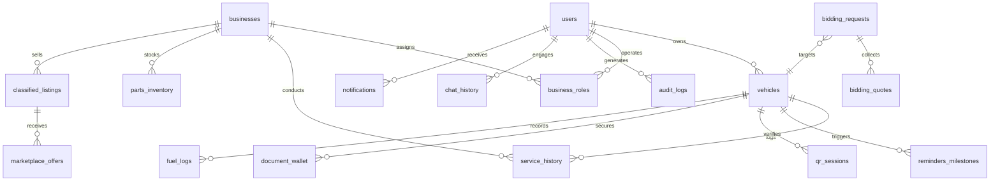

# MyVehicle Care / MyCar Care KH — App System Use Case Specification & Architecture Blueprint
**Cambodia-First AI Vehicle Care Ecosystem**

---

## Executive Summary & App Vision
**MyVehicle Care (MyCar Care KH)** is a comprehensive, Cambodia-focused AI-driven vehicle care ecosystem designed to span the full lifecycle of vehicle ownership, maintenance, and commerce. Far more than a simple classifieds marketplace, its core value proposition is anchored in **trusted digital vehicle identity, secure history tracking, QR-code based peer-to-peer verification, automated upkeep scheduling, decentralized garage networks, and localized AI-driven maintenance diagnostics**.

This document serves as the master blueprint for system developers, QA engineers, UX planners, and business analysts to build, test, and expand the platform across three logical phases.

---

## Part 1: Summary Table of All Use Cases

| UC ID | Module | Use Case Name | Primary Actor | Secondary Actor | Phase | Priority |
|---|---|---|---|---|---|---|
| **UC-01** | User & Role Management | Registration, Security Verification, & Role Setup | Normal User | Admin | Phase 1 | High |
| **UC-02** | User & Role Management | Multi-Role Profile Activation & Fluid Context Switching | Normal User | System | Phase 1 | High |
| **UC-03** | Fleet & Co-Ownership | Fleet Management Delegation & Driver Permissions | Fleet Manager | Driver | Phase 1 | Medium |
| **UC-04** | Vehicle Onboarding | Localized Vehicle Registration & VIN Lookup | Vehicle Owner | System | Phase 1 | High |
| **UC-05** | Digital Identity | Vehicle Profile Customization & Multi-Doc Gallery | Vehicle Owner | System | Phase 1 | High |
| **UC-06** | Peer-to-Peer Identity | Secure Vehicle QR Code Generation & Verification | Vehicle Owner | Garage Staff / Buyer | Phase 1 | High |
| **UC-07** | Document Management | Digital Glovebox (Document Wallet) & Expiry Alerts | Vehicle Owner | System | Phase 1 | High |
| **UC-08** | Booking & Diagnostic | Garage Location Check-In & Service Booking | Vehicle Owner | Garage Staff | Phase 1 | High |
| **UC-09** | Diagnostic Logging | Quick Self-Service Maintenance Log Recording | Vehicle Owner | System | Phase 1 | High |
| **UC-10** | Upkeep Scheduling | Intelligent Recurring Maintenance Reminders & Alerts | Vehicle Owner | Care Alert Center | Phase 1 | High |
| **UC-11** | Fuel & EV Tracking | Fuel Up & EV Charging Station Energy Logs | Vehicle Owner | EV Station Partner | Phase 1 | Medium |
| **UC-12** | Financial Tracking | Consolidated Vehicle Expenses & Cost Categorization | Vehicle Owner | System | Phase 1 | Medium |
| **UC-13** | AI Guidance | Localized AI Vehicle Care Assistant Conversations | Vehicle Owner | Gemini AI Model | Phase 1 | High |
| **UC-14** | Workspace Map | Phnom Penh Interactive Service Finder & Map Views | Vehicle Owner | GPS / Map API | Phase 1 | High |
| **UC-15** | Garage Operations | Garage Profile Verification & Operations Setup | Garage Owner | Super Admin | Phase 1 | High |
| **UC-16** | Garage Workflows | Service Record Intake, Logging, & History Assembly | Garage Staff | Vehicle Owner | Phase 1 | High |
| **UC-17** | Ledger Synchronization | Owner Review, Approval, or Rejection of Service Logs | Vehicle Owner | Garage Owner | Phase 1 | High |
| **UC-18** | Platform Moderation | Business Role Verification, Onboarding, & Approval | Super Admin | Garage/Parts Owner | Phase 1 | High |
| **UC-19** | System Observability | Central Admin Analytics & Audit Log Inspections | Super Admin | Platform Support | Phase 1 | High |
| **UC-20** | Diagnostic Logging | Offline-First Remote Garage QR Code Scanning | Garage Staff | Vehicle Owner | Phase 1 | High |
| **UC-21** | Parts Management | Spare Parts Store Inventory & Stock Control | Parts Shop Owner | Shop Staff | Phase 2 | Medium |
| **UC-22** | Spare Parts Trade | Parts Classified Listing Creator & Active Publishing | Parts Shop Owner | Marketplace Buyer | Phase 2 | Medium |
| **UC-23** | Vehicle Commerce | Vehicle Selling Classified Post Creator & Appraisal | Vehicle Owner | Marketplace Buyer | Phase 2 | Low |
| **UC-24** | Interactive Help | Fix My Car Bidding Request & Quote Submissions | Vehicle Owner | Freelance Mechanic | Phase 2 | Medium |
| **UC-25** | Social Engagement | Help Forum Maintenance Questions & AI Grounding | Forum User | Super Admin / AI | Phase 2 | Low |
| **UC-26** | User Channels | Telegram Notification Integration & Configs | Vehicle Owner | Telegram Bot | Phase 2 | Medium |
| **UC-27** | Garage Operations | Garage Customer Follow-up & Targeted Service Triggers | Garage Owner | Normal User | Phase 2 | Low |
| **UC-28** | Garage Operations | Garage Point of Sale (POS) & Invoice Generator | Garage Staff | Normal User | Phase 2 | Low |
| **UC-29** | Fuel & EV Tracking | Petrol & EV Station Directory Publishing | Station Partner | Super Admin | Phase 2 | Low |
| **UC-30** | Marketplace Trade | In-App Marketplace Buyer Negotiation & Offers | Marketplace Buyer | Marketplace Seller | Phase 2 | Low |
| **UC-31** | Platform Moderation | Marketplace Listings Moderation & Flag Resolution | Super Admin | Marketplace Seller | Phase 2 | High |
| **UC-32** | Interactive Help | Freelance Mechanic Onboarding & Request Bidding | Freelance Mechanic| Normal User | Phase 2 | Medium |
| **UC-33** | Care Rewards System | Care Coin Internal Rewards Engine & Earn Multipliers | Normal User | Garage Staff / Admin | Phase 3 | Low |
| **UC-34** | Care Rewards System | Care Coin Micro-Donations & Cambodia Road-Safety Board| Normal User | Super Admin | Phase 3 | Low |
| **UC-35** | Financial Escrow | Wallet Ledger Synchronization & Escrow Services | Marketplace Buyer | Marketplace Seller | Phase 3 | Low |
| **UC-36** | Premium Subscriptions | Premium Vehicle History Report Unlocks (Paid PDF) | Normal User | System | Phase 3 | Low |
| **UC-37** | Premium Subscriptions | Boosted Classifieds Listings & Ad Slots (Paid Shop) | Marketplace Seller | Super Admin | Phase 3 | Low |
| **UC-38** | Advanced AI | Predictive Maintenance & Predictive Part Failures | Vehicle Owner | Gemini AI Model | Phase 3 | Low |
| **UC-39** | Advanced AI | Advanced Vehicle Diagnostics & Virtual Mechanics AI | Vehicle Owner | Gemini AI Model | Phase 3 | Low |
| **UC-40** | Audit Logs | Super Admin Investor-Grade Fleet Metrics Reports | Super Admin | External Investors | Phase 3 | Low |

---

## Part 2: Detailed Use Cases

---

### [MODULE 01] User Registration & Profile Management

#### Use Case ID: UC-01
* **Use Case Name**: Registration, Security Verification, & Role Setup
* **Primary Actor**: Normal User (Vehicle Owner / App Guest)
* **Secondary Actor**: Super Admin
* **Goal**: Enable a user to register securely via Firebase Auth and establish a secure, localized base profile.
* **Phase**: Phase 1
* **Priority**: High (MVP Core)
* **Trigger**: The user downloads/opens the app for the first time or attempts to access protected screens.
* **Preconditions**: The user has internet connectivity; client is initialized with proper Firebase configs.
* **Main User Flow**:
  1. User lands on the Login/Register Screen and chooses to Register.
  2. User inputs Email, Password, Name, Location/Province (Phnom Penh, Siem Reap, etc.), and Phone Number.
  3. System triggers Firebase Auth `createUserWithEmailAndPassword`.
  4. System records the user payload inside the database user collection, writing default role mapping `Role: "Normal User"`, `Care Coins: 100` (Welcome Reward), and `Status: "Active"`.
  5. System triggers a welcome notification to the user's feed.
* **Alternative Flow**:
  1. User selects "Login with Google".
  2. Firebase OAuth popup triggers, user completes authorization.
  3. System retrieves profile data, checks if user exists in the database. If not, creates user record with default roles.
* **Exception Flow**:
  1. User inputs a phone number already linked to an active account: System displays validation error "Phone number already in use" and prevents submission.
  2. Firebase returns weak password error: System displays helper tips for password strength.
* **Required Data Fields**: `user_id`, `email`, `name`, `phone_number`, `province_location`, `role`, `status`, `avatar_url`, `created_at`.
* **Database Tables Involved**: `users`, `audit_logs`.
* **Permission Rules**: Publicly accessible for registration; only owners of the profile can write or alter details.
* **Notification Logic**: Trigger real-time Welcome In-App notification: *"Suesdei {Name}! Welcome to MyVehicle Care KH! 100 Care Coins have been credited to your wallet. Let's add your first vehicle."*
* **AI Logic, if relevant**: None for basic registration.
* **Admin Control, if relevant**: Super Admin can view, ban, suspend, or update user profiles through the Central Admin Dashboard.
* **Success Result**: User account is written, Firebase session is active, and the client redirects to the main Dashboard.
* **Acceptance Criteria**:
  * User can log in immediately after registration with verified credentials.
  * Welcome Care Coins are credited instantly.
  * Localized location picker includes all Cambodian provinces.
* **UI Screen Needed**: `LoginScreen.tsx`
* **Developer Notes**: Use standard state validator constraints for Cambodian telephone prefixes (e.g., `+855` or `012/015/093/etc.`).

---

#### Use Case ID: UC-02
* **Use Case Name**: Multi-Role Profile Activation & Fluid Context Switching
* **Primary Actor**: Normal User (Vehicle Owner)
* **Secondary Actor**: System
* **Goal**: Enable a Normal User to activate secondary business roles (Garage, Parts Shop, Freelancer) and switch views dynamically without needing separate accounts.
* **Phase**: Phase 1
* **Priority**: High (MVP Core)
* **Trigger**: User clicks "Switch Role" or "Become Partner" on the Account settings sheet.
* **Preconditions**: User has an authenticated account in `Status: "Active"`.
* **Main User Flow**:
  1. User opens Profile Settings, clicks "Register Garage" or "Become Partner".
  2. User completes the verification form, supplying business details, photos, and location coordinates.
  3. System sets the requested role state to `status: "Pending Verification"` and alerts the administrator.
  4. Once Super Admin approves, the user's role configuration is updated.
  5. A navigation switch button becomes visible in the primary App Header, enabling the user to change their active layout from "Customer View" to "Garage Dashboard View".
* **Alternative Flow**:
  1. User is already verified for multiple roles (e.g., Garage Owner and Spare Parts Shop Owner): The switch selector displays all verified options, dynamically replacing routing paths upon selection.
* **Exception Flow**:
  1. User attempts to switch to "Garage View" while verification is still "Pending": The system presents an info banner "Your Garage application is currently being reviewed by our Phnom Penh support team." and blocks the layout swap.
* **Required Data Fields**: `user_id`, `active_role`, `authorized_roles` (array), `business_id` (current associated business).
* **Database Tables Involved**: `users`, `business_roles`, `audit_logs`.
* **Permission Rules**: Switching is allowed only among authorized roles mapped to the authenticated user ID.
* **Notification Logic**: In-App notification on admin approval: *"Congratulations! Your Garage profile has been verified. Swipe down or use the role selector to access your partner workspace."*
* **AI Logic, if relevant**: None.
* **Admin Control, if relevant**: Super Admin exerts total control over verification state, and can strip roles if fraudulent behavior is reported.
* **Success Result**: The workspace UI dynamically replaces the navigation grid and options based on the active role without forcing a sign-out.
* **Acceptance Criteria**:
  * Swap takes less than 300ms.
  * State variables for active views are synchronized.
  * Incomplete profiles are forced to fill missing onboarding fields before activation.
* **UI Screen Needed**: `RoleBasedFormSystem.tsx`
* **Developer Notes**: Use React Context (`UserContext`) to store active role states globally.

---

### [MODULE 02] Vehicle Onboarding & QR Verification

#### Use Case ID: UC-04
* **Use Case Name**: Localized Vehicle Onboarding & VIN Lookup
* **Primary Actor**: Vehicle Owner
* **Secondary Actor**: System
* **Goal**: Empower a vehicle owner to easily register their vehicle into the care network, utilizing intelligent fields localized to the Cambodia context.
* **Phase**: Phase 1
* **Priority**: High (MVP Core)
* **Trigger**: User clicks "Add New Vehicle" inside the App Dashboard or fleet selector.
* **Preconditions**: User is logged in with active session token.
* **Main User Flow**:
  1. User enters brand, model, production year, fuel type, transmission type, license plate format (e.g., Phnom Penh 2A-XXXX or custom plate name), and current odometer mileage.
  2. User enters the VIN (Vehicle Identification Number) or chassis code.
  3. System saves the vehicle, assigning a unique `vehicle_id` and setting it as the user's `active_vehicle_id`.
  4. Default service milestones are auto-generated based on the vehicle mileage and age.
* **Alternative Flow**:
  1. User leaves VIN blank: System alerts that VIN is recommended for trusted service records, but allows completion under "Unverified Status".
* **Exception Flow**:
  1. License plate or VIN is registered to another user's active vehicle: System blocks registration, triggering a security claim alert to Support, and warns the current user of duplication.
* **Required Data Fields**: `vehicle_id`, `user_id`, `brand`, `model`, `year`, `license_plate`, `vin`, `odometer_reading`, `fuel_type`, `engine_type`, `status`, `created_at`.
* **Database Tables Involved**: `vehicles`, `reminders_milestones`, `audit_logs`.
* **Permission Rules**: Only the registered vehicle owner or authorized fleet manager can edit vehicle specs.
* **Notification Logic**: Add a prompt in the App Feed: *"Vehicle {Brand} {Model} registered successfully! A clean QR-Code has been generated for your Digital Glovebox."*
* **AI Logic, if relevant**: Generates a set of personalized common failure-points or maintenance advisories for that specific vehicle year and model (integrated under UC-17).
* **Admin Control, if relevant**: Admins can inspect and arbitrate duplicate registration disputes.
* **Success Result**: The vehicle is added to the user's workspace, and the dynamic vehicle dashboard triggers.
* **Acceptance Criteria**:
  * Vehicle is rendered in the user's vehicle selector dropdown immediately.
  * System properly formats licensing options to support Cambodia special custom license plates.
* **UI Screen Needed**: `VehicleRegistrationSystem.tsx`
* **Developer Notes**: Store Cambodian license formats strictly in database properties to avoid regex crashes.

---

#### Use Case ID: UC-06
* **Use Case Name**: Secure Vehicle QR Code Generation & Verification
* **Primary Actor**: Vehicle Owner
* **Secondary Actor**: Garage Staff / Potential Buyer
* **Goal**: Provide a secure, instant vehicle QR code that lets verified third parties scan and access certified maintenance histories without revealing the owner's sensitive personal contact details.
* **Phase**: Phase 1
* **Priority**: High (MVP Core)
* **Trigger**: User navigates to the "QR Code" tab on the main navigation panel.
* **Preconditions**: User has at least one active vehicle registered.
* **Main User Flow**:
  1. User selects their active vehicle.
  2. System generates an encrypted verification token URL mapped to the vehicle ID.
  3. The screen renders a high-definition QR Code containing the secure verification URL.
  4. The screen includes a toggle: "Allow public history review (Marketplace Buyers)" or "Allow authorized garage service logs".
  5. The Garage Owner scans the QR Code using the app's scanner or standard phone camera.
  6. Scanner retrieves the token, verifies permissions, and loads the secure "Garage Intake Form" with the vehicle's model, mileage, and prior history logs.
* **Alternative Flow**:
  1. Toggling "Public Share Mode" enables anyone scanning the QR code to see an aesthetic, certified digital PDF report of all approved service logs, without phone numbers or names.
* **Exception Flow**:
  1. The QR token is expired: Scanner gets "Secure session expired. Please ask the owner to refresh the QR display."
* **Required Data Fields**: `vehicle_id`, `qr_token`, `expiration_timestamp`, `is_public_sharing_active`.
* **Database Tables Involved**: `vehicles`, `qr_sessions`, `service_history`.
* **Permission Rules**: Read permission for specific fields is strictly dynamic based on owner-controlled share toggles. No personal identifiers are rendered on the scanning device unless authorized.
* **Notification Logic**: In-App trigger upon successful scan: *"Your vehicle QR was successfully scanned by {Garage_Name} for service intake."*
* **AI Logic, if relevant**: None.
* **Admin Control, if relevant**: Admins can view scan telemetry to block rapid token brute-forcing.
* **Success Result**: Secure connection is established, rendering safe records on the scanner and opening service workflows.
* **Acceptance Criteria**:
  * QR Code refreshes security tokens at 60-second intervals for security.
  * Disabling public sharing instantly blocks access via previously scanned URLs.
* **UI Screen Needed**: `QrCodeTab.tsx`
* **Developer Notes**: Do not embed raw user details in QR code payloads; embed only short-lived signed token pointers.

---

### [MODULE 03] Service Logs & Maintenance Ledger

#### Use Case ID: UC-08
* **Use Case Name**: Garage Service Record Intake, Logging, & History Assembly
* **Primary Actor**: Garage Staff (Mechanist / Receptionist)
* **Secondary Actor**: Vehicle Owner
* **Goal**: Enable verified garage partners to easily log completed work (oil changes, brake pad swaps, part replacements) directly into the vehicle's immutable log draft feed.
* **Phase**: Phase 1
* **Priority**: High (MVP Core)
* **Trigger**: Garage owner scans vehicle QR, or selects an active customer booking.
* **Preconditions**: Garage is registered and verified. The vehicle is physically at the garage.
* **Main User Flow**:
  1. Garage Staff selects "New Service Log".
  2. Input fields include: Odometer at Intake, Service Type (Repair, Maintenance, Custom), Parts Replaced, Oil Viscosity and Brand, Total Labor Cost, and Notes.
  3. Staff attaches photos of the physical parts or dashboard.
  4. Staff presses "Submit Record".
  5. The system saves the record in a state of `status: "Pending Owner Approval"`.
  6. The record is instantly pushed to the vehicle owner's Care Alert Center.
* **Alternative Flow**:
  1. Garage Staff uploads an invoice PDF: The system triggers a file upload to storage and attaches it to the draft history ledger.
* **Exception Flow**:
  1. Odometer input is lower than the vehicle's last recorded history: The system displays an alarm message: *"Odometer conflict. Input value ({Input}) cannot be less than last known reading ({LastKnown})."* and prevents submission.
* **Required Data Fields**: `history_id`, `vehicle_id`, `business_id`, `garage_staff_id`, `odometer`, `service_category`, `parts_replaced_json`, `total_cost`, `notes`, `status`, `invoice_url`, `created_at`.
* **Database Tables Involved**: `service_history`, `vehicles`, `audit_logs`.
* **Permission Rules**: Only verified garage businesses or their authorized staff can write service entries.
* **Notification Logic**: Instant mobile push + in-app notification to Vehicle Owner: *"🔧 {Garage_Name} has submitted a new service record for your approval. Odometer: {Mileage} km. Check and tap to authorize."*
* **AI Logic, if relevant**: None.
* **Admin Control, if relevant**: Admins can arbitrate in case of billing fraud or fake records disputes.
* **Success Result**: Service record is stored in draft state, and the owner is prompted for quick action.
* **Acceptance Criteria**:
  * Work records are clearly separated from user's self-logged data.
  * Files are stored securely on the backend.
* **UI Screen Needed**: `GarageDashboard.tsx` (Service Form Module)
* **Developer Notes**: Ensure all input cost fields default properly to USD and Khmer Riel (KHR) configurations.

---

#### Use Case ID: UC-09
* **Use Case Name**: Ledger Synchronization: Owner Review, Approval, or Rejection of Service Logs
* **Primary Actor**: Vehicle Owner
* **Secondary Actor**: Garage Owner
* **Goal**: Prevent fraudulent service entries by requiring vehicle owners to manually approve garage-submitted logs before they are officially permanently appended to the vehicle's history.
* **Phase**: Phase 1
* **Priority**: High (MVP Core)
* **Trigger**: Vehicle Owner receives an approval prompt or visits "Pending Approvals".
* **Preconditions**: A service log is recorded in `status: "Pending Owner Approval"`.
* **Main User Flow**:
  1. User navigates to the "Pending Approvals" screen on their dashboard.
  2. User reviews the garage details, cost, parts, and invoice photos.
  3. User taps "Approve Service Log".
  4. The system updates the service record status to `status: "Approved"` and appends it to the immutable "Verified History Ledger".
  5. The vehicle's master odometer reading is auto-incremented to the intake mileage.
  6. Maintenance milestones associated with the service are marked as "Completed" (e.g., Oil Change reset).
* **Alternative Flow**:
  1. User taps "Reject & Flag": User inputs a reason (e.g., "Incorrect mileage entered" or "I did not visit this garage").
  2. System sets record status to `status: "Rejected"` and notifies the garage owner with the owner's feedback.
* **Exception Flow**:
  1. Connection timeout: The system caches the signed cryptographic approval locally and syncs it immediately upon recovery.
* **Required Data Fields**: `history_id`, `status`, `approval_timestamp`, `rejection_reason_notes`.
* **Database Tables Involved**: `service_history`, `vehicles`, `notifications`.
* **Permission Rules**: Only the verified owner or delegated primary driver of the vehicle has authorization to approve/reject draft logs.
* **Notification Logic**:
  * Push to Garage Owner on approval: *"✅ Approved: Record for {Brand} {Model} (Plate: {Plate}) was authorized by owner."*
  * Push to Garage Owner on rejection: *"⚠️ Rejected: Record for {Brand} {Model} was denied. Reason: {Reason}."*
* **AI Logic, if relevant**: None.
* **Admin Control, if relevant**: Banned garages have their submitted records marked null.
* **Success Result**: The verified ledger is updated, mileage logs are locked, and the service status transitions.
* **Acceptance Criteria**:
  * Approved entries are permanently locked and cannot be edited by the garage.
  * Rejected items are excluded from vehicle health stats and calculations.
* **UI Screen Needed**: `PendingApprovalScreen.tsx`
* **Developer Notes**: Ensure the approval trigger updates all corresponding local notification items and clears banners.

---

### [MODULE 04] Alerts, Scheduling & Reminders

#### Use Case ID: UC-10
* **Use Case Name**: Intelligent Recurring Maintenance Reminders & Alerts
* **Primary Actor**: Vehicle Owner
* **Secondary Actor**: Care Alert Center
* **Goal**: Provide an active alarm panel showing upcoming maintenance tasks, separating safety-critical (urgent) reminders from standard (routine) upkeep tasks.
* **Phase**: Phase 1
* **Priority**: High (MVP Core)
* **Trigger**: Vehicle mileage updates, elapsed calendar time, or system startup.
* **Preconditions**: At least one active vehicle is linked to the user's account.
* **Main User Flow**:
  1. User enters the "Alarms & Reminders" tab.
  2. The screen splits into:
     * **🚨 URGENT ALERTS**: Active safety hazards (e.g., brake wear, low oil, engine check overdue).
     * **📅 ROUTINE ADVISORIES**: Standard, mileage-based schedules (e.g., windshield wipers, spark plugs, tire rotation).
  3. The system checks active vehicle mileage and log history. If a task is within 10% of target limits or overdue, it moves to "Urgent Alerts".
  4. User can configure alarm thresholds (e.g., "Remind me 500km early").
  5. User can dismiss standard notifications, snooze them for 7 days, or log a corresponding service directly from the alert card.
* **Alternative Flow**:
  1. The user triggers a simulated browser push notification using the Simulator panel (e.g., during diagnostics testing) to test alert behaviors.
* **Exception Flow**:
  1. No mileage information exists: The system relies strictly on chronological dates (time elapsed) to generate notifications.
* **Required Data Fields**: `reminder_id`, `vehicle_id`, `task_type`, `due_mileage`, `due_date`, `urgency_level`, `last_completed_at`, `status`.
* **Database Tables Involved**: `reminders_milestones`, `vehicles`, `notifications`.
* **Permission Rules**: Only owners or primary drivers of the vehicle can view and dismiss the alert dashboard.
* **Notification Logic**: Pushes real-time browser push notifications. If Telegram preferences are configured, replicates the alert payload to the Telegram Bot.
* **AI Logic, if relevant**: Gemini analyzes driving profiles to dynamically recalibrate maintenance schedules (e.g., advising early brake fluid changes if stop-and-go Phnom Penh traffic driving behavior is detected).
* **Admin Control, if relevant**: Admin can populate globally recommended milestones by vehicle model.
* **Success Result**: The owner has clear visibility of vital vehicle needs and can avoid unexpected mechanical breakdowns.
* **Acceptance Criteria**:
  * Visual separation between urgent (red) and routine (blue/slate) alerts is clean and high-contrast.
  * Odometer updates instantly push tasks across priority boundaries.
* **UI Screen Needed**: `RemindersPanel.tsx` (Alarms Center)
* **Developer Notes**: Optimize list filtering locally to keep scrolling responsive.

---

### [MODULE 05] Interactive Assistance & AI Insights

#### Use Case ID: UC-13
* **Use Case Name**: Localized AI Vehicle Care Assistant Conversations
* **Primary Actor**: Vehicle Owner
* **Secondary Actor**: Gemini AI Model
* **Goal**: Provide an active AI assistant that understands local Cambodian conditions (dirt road silt, monsoon flooding, high humidity) to answer care questions and analyze telemetry inputs.
* **Phase**: Phase 1
* **Priority**: High (MVP Core)
* **Trigger**: User opens the "AI Assistant" screen.
* **Preconditions**: Model initialization is correctly set up server-side.
* **Main User Flow**:
  1. User accesses the Care Assistant.
  2. The system auto-injects context: Vehicle model, year, last recorded mileage, and active alerts.
  3. User types or taps pre-populated questions: "Why is my brakes squeaking in the rainy season?" or "What oil should I use for a 2012 Prius in Phnom Penh?"
  4. The server proxies the request, formats the system prompt with Cambodian driving conditions, and requests response streaming.
  5. The assistant returns localized, non-prescriptive, helpful guidance and recommends qualified local garages nearby.
* **Alternative Flow**:
  1. User snaps a picture of their engine dashboard warning light: The model reviews the photo, diagnoses the likely fault, and links the user to local towing or diagnostic garages.
* **Exception Flow**:
  1. API limit hit: System alerts "AI Assistant is resting. Try again shortly." and provides standard troubleshooting lookup resources.
* **Required Data Fields**: `chat_session_id`, `user_id`, `vehicle_id`, `message_payload`, `timestamp`.
* **Database Tables Involved**: `chat_history`, `vehicles`.
* **Permission Rules**: Conversations are private and restricted to the active owner.
* **Notification Logic**: None.
* **AI Logic, if relevant**: Uses Gemini 2.5 Flash with localized system prompts (focusing on Cambodia climate, dust, typical vehicle imports like Toyota Prius/Lexus RX, etc.).
* **Admin Control, if relevant**: None.
* **Success Result**: The user receives detailed, educational automotive guidance immediately.
* **Acceptance Criteria**:
  * Answers are presented in markdown format.
  * Response times are optimized.
  * Disclaimers are clearly visible: *"AI advice is educational only. Consult verified mechanics for physical safety."*
* **UI Screen Needed**: `AICareAssistant.tsx`
* **Developer Notes**: Never expose the API key in the client console; keep API requests secured behind `/api/chat` proxies.

---

### [MODULE 06] Garage & Shop Workspace Operations

#### Use Case ID: UC-15
* **Use Case Name**: Garage Profile Verification & Operations Setup
* **Primary Actor**: Garage Owner
* **Secondary Actor**: Super Admin
* **Goal**: Permit automotive repair shops to set up their certified profiles, list opening hours, location coordinates, specialties, and upload registration papers for verification.
* **Phase**: Phase 1
* **Priority**: High (MVP Core)
* **Trigger**: A verified user toggles active view to become a Business Partner.
* **Preconditions**: User is logged in and verified.
* **Main User Flow**:
  1. User completes the Partner Registration Form, specifying Garage Name, GPS Location, Telephone contacts, specialties (Brakes, AC, Hybrid Systems, etc.), and uploads license files.
  2. User inputs staff counts and adds core services with estimated prices.
  3. System saves details as `status: "Unverified"`.
  4. Once Super Admin verifies papers, the status is set to `status: "Active"`.
  5. The Garage profile becomes visible to users on the Interactive Map and Search fields.
* **Alternative Flow**:
  1. Garage owner adds team members by inputting their registered email accounts, sending invitations.
* **Exception Flow**:
  1. GPS Coordinates are out of Cambodian territory: System alerts validation error "Business coordinates must be within Cambodia borders."
* **Required Data Fields**: `business_id`, `owner_id`, `name`, `license_number`, `gps_latitude`, `gps_longitude`, `specialties`, `status`, `opening_hours`.
* **Database Tables Involved**: `businesses`, `business_roles`, `audit_logs`.
* **Permission Rules**: Only verified owners can alter business profile data and manage active staff logs.
* **Notification Logic**: Push notify owner when verification is complete: *"Your Garage {Name} has been verified and is now live on the service locator map."*
* **AI Logic, if relevant**: None.
* **Admin Control, if relevant**: Full suspension capabilities in case of user complaints or fraudulent listings.
* **Success Result**: The Garage business profile is live, opening access to team setups and booking workflows.
* **Acceptance Criteria**:
  * Business coordinates successfully map on Leaflet or Google Map instances.
  * Invitations correctly map recipient user roles upon login.
* **UI Screen Needed**: `PartnerPortal.tsx`
* **Developer Notes**: Standardize latitude bounds [9.5, 15.0] and longitude bounds [102.0, 108.0] for Cambodian region constraints.

---

## Part 3: Phase Recommendation Roadmap

To construct a high-velocity, reliable, and functional system, the roadmap is divided into three distinct phases. 

```
                                  MYVEHICLE CARE ROADMAP
                                  
   PHASE 1 (MVP)                 PHASE 2 (COMMERCE)            PHASE 3 (SCALE)
   [Trust & Identity]            [Trade & Connections]         [Rewards & Predictive AI]
   ==================            =====================         =========================
   - User Auth & Switching       - Spare Parts Shop DB         - Care Coin Reward Engine
   - Vehicle QR-Code Systems     - Parts Classifieds Trade     - Micro-Donation Boards
   - Admin & Role Forms          - Forum & Bidding Requests    - Wallet & Escrow Ledger
   - Service History Ledger      - Fix My Car Mechanics        - Premium History Reports
   - Owner Ledger Sync Approvals - Telegram Notifications      - AI Predictive Warnings
   - Alert Center Reminders      - Petrol & EV Directory       - Shop Placement Ad Boost
   - Document Wallet & Map       - In-App Chat Negotiations    - Investor System Dashboards
```

### Phase 1: MVP Core (Core Trust & Operational Identity)
**Focus**: The foundational value of MyVehicle Care lies in authenticated vehicle identity and trusted, synchronized service logs. Phase 1 focuses heavily on building this secure trust loop between vehicle owners, garages, and administrators.
* **Core Modules**:
  * User Authentication & Local Profile Context Switching (`RoleBasedFormSystem`).
  * Vehicle Registration, Digital Glovebox, and Encrypted vehicle QR-Codes.
  * Garage Profile Registration, Verification Uploads, and Staff Invitation.
  * Secure Service Log Entry Intake (via Garage scan) with Owner Approval Workflow.
  * Active Maintenance Alarms (Alarms & Reminders Panel with Priority Separation).
  * Digital Glovebox document uploads and Interactive Service Finder Maps.
  * Standard AI Localized Care Assistant.
  * Super Admin Control Room (Verification, Audit, User suspension).

### Phase 2: Marketplace, Bidding & Communication
**Focus**: Once a healthy network of users and garages is live, Phase 2 implements commerce, active bidding, and social layers to scale utility.
* **Core Modules**:
  * Spare Parts Catalog, Shop Inventories, and Live Classifieds Marketplace.
  * Vehicle Trade/Sale Marketplace.
  * "Fix My Car" Community Requests with Freelance Mechanic Bidding Systems.
  * Help Forum with AI grounding.
  * Direct In-App Chat & Price Negotiations.
  * Telegram Notification Bot Integration.
  * Garage customer follow-up engines, basic POS and invoicing systems.
  * Petrol & EV charging stations directory setup.

### Phase 3: Financial Escrow, Loyalty & Advanced AI
**Focus**: Unlocking high-value enterprise features, deep gamification, monetization, and automated predictive intelligence.
* **Core Modules**:
  * Care Coin Loyalty Rewards ledger (Gamification: driving responsibly, logging on time).
  * Care Coin Cambodia Road-Safety Donations Board.
  * Secure Wallet, escrow transactions, and billing ledgers.
  * Premium verified vehicle reports (Paid unlocks, downloadable PDFs).
  * Promoted/Boosted listings for Parts Shops and Garages.
  * Predictive Maintenance and automated AI diagnostics.
  * Platform Investor dashboard and advanced metrics analysis.

---

## Part 4: Unified Permission Matrix

| User Role | Read Vehicle History | Scan QR & Intake | Approve/Reject Logs | Edit Garage Profile | Post Part Classifieds | Moderate Listings | View Platform Audits | Earn/Donate Coins |
|---|:---:|:---:|:---:|:---:|:---:|:---:|:---:|:---:|
| **Normal User** | Active Only | ❌ | ✅ (Own Only) | ❌ | ❌ | ❌ | ❌ | ✅ (Phase 3) |
| **Driver** | Active Only | ❌ | ✅ (Assigned) | ❌ | ❌ | ❌ | ❌ | ✅ (Phase 3) |
| **Fleet Manager**| ✅ (All Fleet) | ❌ | ✅ (All Fleet) | ❌ | ❌ | ❌ | ❌ | ✅ (Phase 3) |
| **Garage Owner** | Authorized | ✅ | ❌ | ✅ | ❌ | ❌ | ❌ | ✅ (Phase 3) |
| **Garage Manager**| Authorized | ✅ | ❌ | ✅ | ❌ | ❌ | ❌ | ❌ |
| **Mechanic** | Authorized | ✅ | ❌ | ❌ | ❌ | ❌ | ❌ | ❌ |
| **Receptionist** | Authorized | ✅ | ❌ | ❌ | ❌ | ❌ | ❌ | ❌ |
| **Cashier** | Authorized | ✅ | ❌ | ❌ | ❌ | ❌ | ❌ | ❌ |
| **Parts Owner** | ❌ | ❌ | ❌ | ❌ | ✅ | ❌ | ❌ | ✅ (Phase 3) |
| **Parts Staff** | ❌ | ❌ | ❌ | ❌ | ✅ (Assigned) | ❌ | ❌ | ❌ |
| **Freelancer** | Authorized | ✅ | ❌ | ❌ | ❌ | ❌ | ❌ | ✅ (Phase 3) |
| **EV / Petrol** | ❌ | ❌ | ❌ | ❌ | ❌ | ❌ | ❌ | ❌ |
| **Market Seller**| ❌ | ❌ | ❌ | ❌ | ✅ | ❌ | ❌ | ✅ (Phase 3) |
| **Market Buyer** | Public Only | ❌ | ❌ | ❌ | ❌ | ❌ | ❌ | ✅ (Phase 3) |
| **Forum User** | Public Only | ❌ | ❌ | ❌ | ❌ | ❌ | ❌ | ✅ (Phase 3) |
| **Super Admin** | ✅ | ✅ | ✅ | ✅ | ✅ | ✅ | ✅ | ✅ (Phase 3) |
| **Support Staff**| ✅ | ✅ | ❌ | ✅ | ✅ | ✅ | ✅ (Read-only) | ❌ |

---

## Part 5: Database Relationship Map (Entity Relationship Model)



### Core Schema Definition & Field Guidelines
1. **users**: Primary demographic data.
2. **vehicles**: Main asset register. Must have `active_vehicle_id` mapping.
3. **service_history**: Lockable maintenance ledger. Links `vehicle_id`, `business_id` (optional), and `user_id` (creator). Status includes: `pending_approval`, `approved`, `rejected`.
4. **businesses**: Store profile (Garages, Parts shops, EV stations). Requires `owner_id`.
5. **business_roles**: Invited employee records. Maps user email or ID to specific sub-permissions inside a `business_id`.
6. **reminders_milestones**: Pre-populated maintenance items. Evaluated dynamically against mileage and duration.
7. **document_wallet**: Links file attachment URLs and expiry dates directly to `vehicle_id`.
8. **audit_logs**: Immutable system track for security compliance.

---

## Part 6: Notification Trigger List

| Trigger Event | Source Actor | Target Recipient | Channels | Message Payload Format |
|---|---|---|---|---|
| **Service Draft Posted** | Garage Staff | Vehicle Owner | In-App, Push | *"{Garage_Name} has logged a new service draft for {Model} (Odo: {Odo} km). Tap to review and approve."* |
| **Draft Approved** | Vehicle Owner | Garage Owner | In-App, Push | *"✅ Service entry approved! {Model} history updated. Mileage locked at {Odo} km."* |
| **Draft Rejected** | Vehicle Owner | Garage Owner | In-App, Push | *"⚠️ Draft Rejected: Owner declined intake record. Reason: {Rejection_Reason}."* |
| **Milestone Alert** | System | Vehicle Owner | In-App, Push, Telegram | *"🚨 Overdue Alert: {Vehicle_Brand} {Model} requires urgent {Milestone_Name} (Overdue by {Km} km)."* |
| **Expiry Reminder** | System | Vehicle Owner | In-App, Push | *"📅 Expiry Alert: Your Car Tax / Road Insurance for {Plate} expires in 14 days. Please renew."* |
| **Staff Invitation** | Garage Owner | Garage Staff | In-App, Email | *"Suesdei! {Garage_Name} invites you to join their digital staff as {Role}. Click to accept."* |
| **Bid Received** | Freelance Mech | Vehicle Owner | In-App, Push, Telegram | *"🔧 Repair offer: {Mechanic_Name} bid ${Price} on your '{Request_Title}' ticket. Review details."* |
| **Classified Offer** | Buyer | Seller | In-App, Push | *"💰 Offer received: A user offered ${Offer_Price} for your parts listing '{Listing_Name}'."* |
| **Role Verified** | Super Admin | Partner User | In-App, Push | *"Congratulations! Your business registration has been authorized. Tap to activate workspace."* |

---

## Part 7: UI Screen Checklist

### Phase 1: MVP Core Dashboard Layouts
* [ ] **`LoginScreen.tsx`**
  * Firebase Authentication fields (Email, password, localized Cambodian province selector).
* [ ] **`Dashboard.tsx` (Unified Hub)**
  * Active vehicle visual summary, odometer quick-editor, active alarms summary, quick QR drawer toggle.
* [ ] **`RoleBasedFormSystem.tsx`**
  * Profile settings selector to register business roles (Garages, Parts Shop) with verification document uploads.
* [ ] **`VehicleRegistrationSystem.tsx`**
  * Add vehicle specs (Cambodian plate configs, chassis/VIN, engine selection, initial odometer).
* [ ] **`QrCodeTab.tsx`**
  * Security token encoder/decoder, secure scanner camera canvas, public history display toggle.
* [ ] **`RemindersPanel.tsx` (Alarms Center)**
  * High-contrast split feeds: Urgent alerts (Safety/Overdue) vs Routine Maintenance schedule tasks. Complete with mock push-notification simulator controls.
* [ ] **`PendingApprovalScreen.tsx`**
  * Owner's workspace showing draft garage intakes, parts replaced, total costs, invoice images, and Approve/Reject controls.
* [ ] **`GarageDashboard.tsx`**
  * Partner workspace displaying intake queues, customer booking agendas, team authorization sheets, and intake log templates.
* [ ] **`PartnerPortal.tsx`**
  * Setup workspace for garage business registration, mapping specialties, GPS location, and hours of operation.
* [ ] **`AICareAssistant.tsx`**
  * Interactive dialogue box displaying localized vehicle diagnosis queries, utilizing context injected directly from the active vehicle ID.
* [ ] **`MyCarCareMap.tsx` (Service Finder)**
  * Phnom Penh-centric map (using Leaflet or Google Maps Platform) pinning nearby certified garages, EV stations, and petrol coordinates.
* [ ] **`AdminPanel.tsx` (Central Controller)**
  * Super Admin panel: Business verify lists, suspension logs, user database monitors, system security settings.

---

## Part 8: Developer Implementation Checklist

### Step 1: Establish Identity & Base Routing
* [ ] Verify Firebase configuration values and environment variables. Declare `GEMINI_API_KEY` strictly inside secure server-side properties.
* [ ] Wire Global state management using React Context. Ensure `active_vehicle_id` tracks smoothly on any component state update.
* [ ] Implement localized province lists in code constants.

### Step 2: Assemble Asset Registration & Visual Identity
* [ ] Build vehicle onboarding forms. Lock validation rules so odometer logs cannot accept reverse values.
* [ ] Standardize typography utilizing modern sans-serif display paired with technical monospace labels.

### Step 3: Implement QR Verification Pipeline
* [ ] Build security token rotator for vehicle QR codes. Ensure scans point to `/verify/vehicle/:token_id` to safeguard user data.
* [ ] Set up mobile scanner hooks.

### Step 4: Program Synchronization Ledger
* [ ] Construct the `/api/service-history` endpoints. Secure database structures so records posted by businesses default to a pending status.
* [ ] Build database triggers updating master vehicle odometers only upon owner's verified authorization.

### Step 5: Activate Active Alarms Center
* [ ] Set up the Alarms & Reminders visual layouts.
* [ ] Implement the mock browser push-notification panel and simulator triggers so developers and QA can instantly test priority shifts.

### Step 6: Connect Interactive Help
* [ ] Connect Gemini 2.5 Flash API proxies server-side.
* [ ] Formulate systematic instructions prompting the model to prioritize Cambodian terrain constraints (flooding, dust, high wear).

---

## Part 9: QA Testing Checklist

### Test Scenario A: Multi-Role Authorization Integrity
* [ ] **Test A.1**: Attempt to access the Garage Dashboard view while logged in as a standard user with no business status.
  * *Expected Result*: Navigation blocks access, presenting permission error or redirecting to Partner Registration.
* [ ] **Test A.2**: Verify that inviting a Garage staff member links their email to the business database and restricts their role strictly to staff permissions.
  * *Expected Result*: Invited staff user inherits read/write intake logs capability, but is blocked from changing business bank accounts or owner credentials.

### Test Scenario B: Odometer Security & Approval Synchronization
* [ ] **Test B.1**: Log a garage service draft with intake odometer lower than the vehicle's last certified mileage log.
  * *Expected Result*: Service API rejects request with Odometer conflict error (Code 422).
* [ ] **Test B.2**: Appoint garage service draft and verify vehicle master mileage before the owner clicks approve.
  * *Expected Result*: Master mileage remains at previous reading. Once approved, mileage increments, and the log state shifts instantly.

### Test Scenario C: QR Encryption Safety
* [ ] **Test C.1**: Scan public QR share token outside the authenticated app environment.
  * *Expected Result*: Scanner renders clean certified historical maintenance ledger. Personal owner profiles, telephone numbers, and email identities are 100% hidden.
* [ ] **Test C.2**: Load QR code after 60 seconds have elapsed.
  * *Expected Result*: QR code updates graphics to reflect refreshed validation token. Older scanned assets are blocked from opening active entries.

---

## Part 10: Duplicated & Overlapping Features for Merger

1. **`AIDreamCarAdvisor.tsx`** & **`PremiumDreamCarAdvisor.tsx`**
   * *The Problem*: Duplicate AI components handling car purchase questions.
   * *Resolution*: Merge both into a single, cohesive view called `AIDreamCarAdvisor.tsx`. Use a premium flag check in the database user schema to toggle premium unlock capabilities inside the single code structure.
2. **`QuickServiceLogSystem.tsx`** & **`MonthlyMaintenanceTab.tsx`** & **`AppointmentsTab.tsx`**
   * *The Problem*: Disjointed, fragmented logs. Users are confused as to where standard repair entries should be logged.
   * *Resolution*: Unify these features under a single master component **`MyCarCareHistoryLedger.tsx`** or inside the vehicle profile. All maintenance entries must map to the unified `service_history` database table.
3. **`PartsDashboard.tsx`** & **`PartsInventory.tsx`** & **`PartsStockControl.tsx`**
   * *The Problem*: Scattered inventory tools.
   * *Resolution*: Merge into a single master workflow: **`PartsStoreManager.tsx`** with internal sub-tabs for Inventory, Stock Control, and Reports.

---

## Part 11: Non-MVP Deferred Features List
*(Postponed to Phase 2 & Phase 3 to ensure a robust, high-quality, and bug-free Phase 1 release)*

1. **Classified Marketplaces (`ClassifiedsMarketplace.tsx`, `PartsMarketplace.tsx`)**
   * *Why deferred*: Requires complicated checkout funnels, image optimization scripts, and buyer/seller dispute resolution protocols.
2. **Help Forums & Bidding Forums (`HelpForum.tsx`, `FixMyCarBiddingModule.tsx`)**
   * *Why deferred*: Demands high community traffic to thrive. Focus first on tools that serve users individually.
3. **Internal Rewards System & Escrow Wallets (`CareCoinWallet.tsx`, `MyCarCareCoinSystem.tsx`)**
   * *Why deferred*: Requires strict security audits, bank integrations, and regulatory verification. Not necessary for validation of core service log tracking.
4. **Telegram Integration Settings (`TELEGRAM_INTEGRATION.md`)**
   * *Why deferred*: Demands persistent bot background services and webhook configurations. Postpone to Phase 2.
